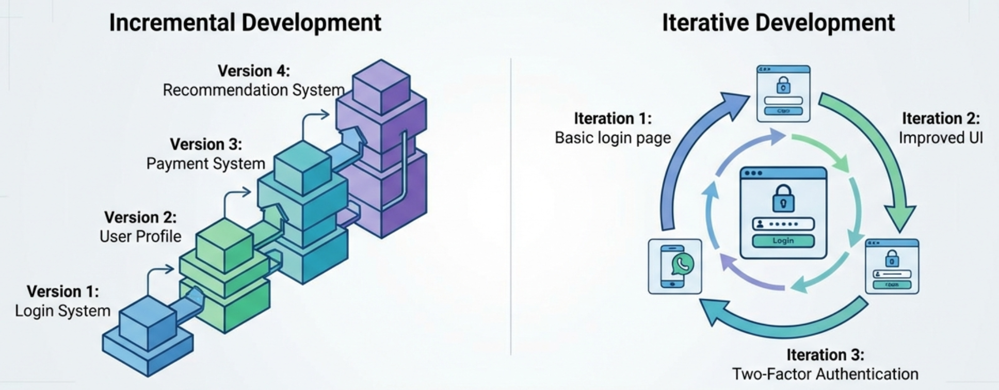
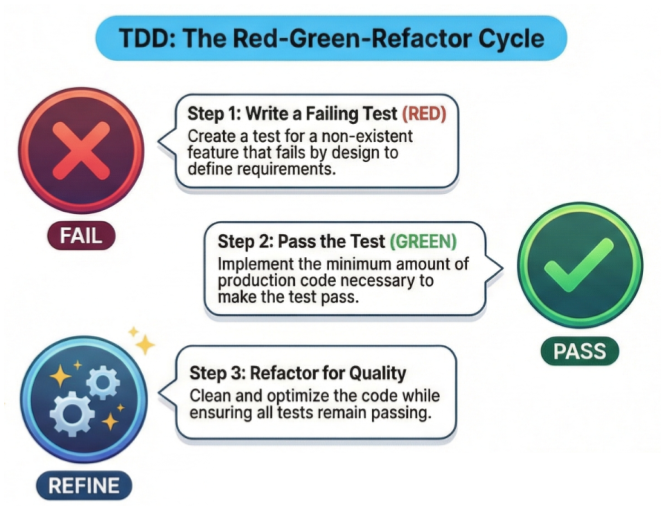
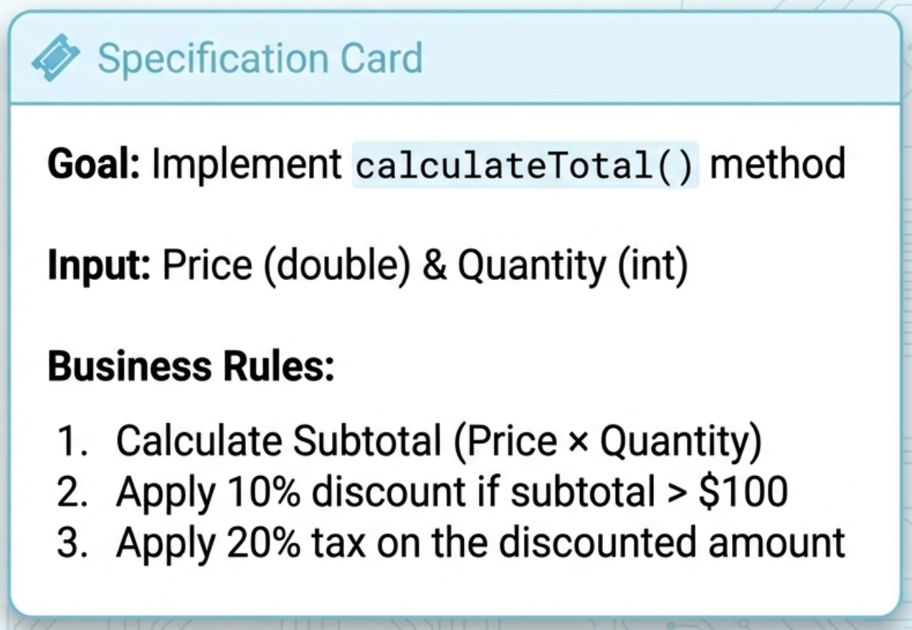
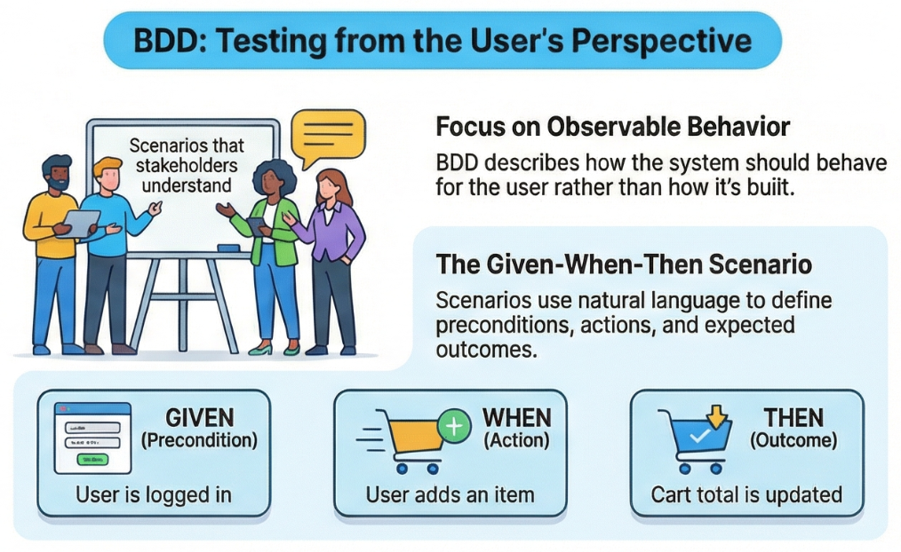
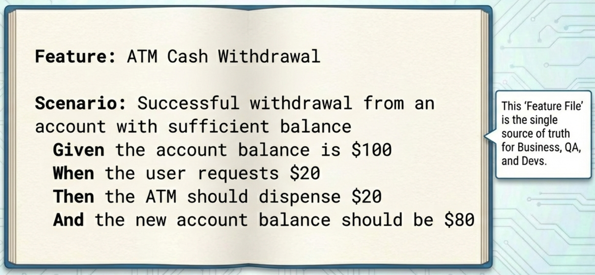

# Module 3: Test-Driven Development (TDD) and Behavior-Driven Development (BDD)

---
<!-- TOC -->
* [Module 3: Test-Driven Development (TDD) and Behavior-Driven Development (BDD)](#module-3-test-driven-development-tdd-and-behavior-driven-development-bdd)
  * [What is TDD?](#what-is-tdd)
    * [Agile Development Context](#agile-development-context)
    * [TDD Cycle: Red-Green-Refactor](#tdd-cycle-red-green-refactor)
  * [Case Study: Developing a **Billing System** using TDD approach.](#case-study-developing-a-billing-system-using-tdd-approach)
    * [Step 1: Write a Failing Test (RED)](#step-1-write-a-failing-test-red)
    * [Step 2: Write Just Enough Code to Pass (GREEN)](#step-2-write-just-enough-code-to-pass-green)
    * [Step 3: Refactor the Code (REFACTOR)-Optional](#step-3-refactor-the-code-refactor-optional)
  * [What is BDD?](#what-is-bdd)
  * [Case Study: ATM Cash Withdrawal](#case-study-atm-cash-withdrawal)
<!-- TOC -->


---

## What is TDD?

**Test-Driven Development (TDD)** is a software development approach in which **tests are written before the production 
code**. It is a **core practice in Agile software development**, particularly in **Extreme Programming (XP)**.


**Key Characteristic**

- **Tests drive development** – Code is written based on well-defined tests.
- **Code quality improves** – Continuous refactoring leads to better structure and maintainability.
- **Defects are reduced early** – Issues are detected before deployment.


### Agile Development Context




Agile is a flexible and modern software development methodology that emphasizes:

- **Incremental development:** The system is built in small, usable increments, each adding functionality.  
  *Example:*
    - Version 1: Login System
    - Version 2: User Profile
    - Version 3: Payment System
    - Version 4: Recommendation System

- **Iterative development:** Features are refined in cycles based on feedback.  
  *Example for Login System:*
    - Iteration 1: Basic login page
    - Iteration 2: Improved UI
    - Iteration 3: Two-Factor Authentication

TDD align closely well with Agile because it ensures **tests drive development**, improves **code quality**, and 
detects **defects early**.


---

### TDD Cycle: Red-Green-Refactor



1. **Red:** Write a failing test because the feature does not exist yet.
2. **Green:** Write the minimal code to pass the test.
3. **Refactor:** Improve the code while keeping all tests passing.


## Case Study: Developing a **Billing System** using TDD approach.





### Step 1: Write a Failing Test (RED)

 
First write a **JUnit test** for the `calculateTotal()` method.

**Expected methods:**
- Multiply `price * quantity`.
- Apply a **10% discount** if subtotal > $100.
- Apply a **20% tax** on the discounted amount.

**Code Example**
> test/~/BillingSystemTest.java

```java
import static org.junit.jupiter.api.Assertions.*;
import org.junit.jupiter.api.Test;

public class BillingSystemTest {

    @Test
    void calculateTotal_validInputWithDiscountAndTax_returnsCorrectTotal() {
      BillingSystem billing = new BillingSystem();
  
      double total = billing.calculateTotal(50, 3);
      // (50 * 3) = 150
      // Discount = 15
      // Tax = 27
      // Total = 162
  
      assertEquals(162.0, total, 0.01);
    }
}
```

Expected behavior: The test fails because BillingSystem does not exist yet. (RED Phase Completed)

### Step 2: Write Just Enough Code to Pass (GREEN)

Implement a basic version of the calculateTotal() method inside BillingSystem.java to make the test pass.

**Code Example**
> main/~/BillingSystem.java

```java
public class BillingSystem {
    public double calculateTotal(double price, int quantity) {
        double subtotal = price * quantity;
        double discount = subtotal > 100 ? subtotal * 0.1 : 0; // 10% discount if subtotal > $100
        double tax = (subtotal - discount) * 0.2; // 20% tax
        return subtotal - discount + tax;
    }
}
```
Expected behavior: The test passes.(GREEN phase completed)

### Step 3: Refactor the Code (REFACTOR)-Optional

Refactor the code by extracting helper methods to improve readability and maintainability.


**Code Example**
> main/~/BillingSystem.java

```java
public class BillingSystem {
    public double calculateTotal(double price, int quantity) {
        double subtotal = price * quantity;
        double discount = calculateDiscount(subtotal);
        double tax = calculateTax(subtotal - discount);
        return subtotal - discount + tax;
    }

    private double calculateDiscount(double subtotal) {
        return subtotal > 100 ? subtotal * 0.1 : 0;
    }

    private double calculateTax(double amount) {
        return amount * 0.2;
    }
}

```
Expected behavior: The code becomes more modular and readable, and tests still pass!  (REFACTOR Phase Completed)


**Applying TDD for Exception Handling**

Now we apply the same RED → GREEN → REFACTOR cycle to exception cases.

Updated Tests with Proper Naming

**Code Example**
> test/~/BillingSystemTest.java

```java
import static org.junit.jupiter.api.Assertions.*;
import org.junit.jupiter.api.Test;

public class BillingSystemTest {

  @Test
  void calculateTotal_validInputWithDiscountAndTax_returnsCorrectTotal() {
    BillingSystem billing = new BillingSystem();
    double total = billing.calculateTotal(50, 3);
    assertEquals(162.0, total, 0.01);
  }

  @Test
  void calculateTotal_negativePrice_throwsIllegalArgumentException() {
    BillingSystem billing = new BillingSystem();

    assertThrows(IllegalArgumentException.class,
            () -> billing.calculateTotal(-50, 3));
  }

  @Test
  void calculateTotal_negativeQuantity_throwsIllegalArgumentExceptionWithMessage() {
    BillingSystem billing = new BillingSystem();

    IllegalArgumentException exception = assertThrows(
            IllegalArgumentException.class,
            () -> billing.calculateTotal(50, -3)
    );

    assertEquals("Price and quantity must be positive", exception.getMessage());
  }
}

```

---

## What is BDD?

**Behavior-Driven Development (BDD)** extends TDD by focusing on **system behavior from the user’s perspective** using 
**natural language scenarios**.

BDD focuses on what the system should do from the user or business perspective, using a shared language.



**Key Points**

- **Focus:** User requirements and observable system behavior
- **Audience:** Developers, testers, and non-technical stakeholders
- **Test Format:** Uses **Given–When–Then** scenarios
- **Level:** Often applied in system or acceptance testing  

**Cucumber** is a software tool for Behavior-Driven Development (BDD) that allows you to write automated tests in a 
human-readable format.

**Gherkin** is a domain-specific language (DSL) used to describe software requirements in a structured, 
semi-natural language format using the **Given/When/Then** structure.


---

## Case Study: ATM Cash Withdrawal

```text
src
 ├─ main
 │   └─ java
 │       └─ cc
 │           └─ ku
 │               └─ st
 │                   └─ module3
 │                       └─ bdd
 │                           └─ Account.java      <- Domain code
 └─ test
     ├─ java
     │   └─ cc
     │       └─ ku
     │           └─ st
     │               └─ module3
     │                   └─ bdd
     │                       ├─ steps
     │                       │   └─ CashWithdrawalSteps.java
     │                       ├─ runner
     │                       │   └─ TestRunner.java
     │                       └─ unit
     │                           └─ AccountTest.java
     └─ resources
         └─ features
             └─ cash_withdrawal.feature
```


Cucumber uses **Gherkin** (the Given/When/Then language) to connect human-readable requirements to technical test code.


1) Feature File (`cash_withdrawal.feature`)

This is the **Gherkin file**, written in plain English so that business owners, developers, and testers can all understand it.




**Feature:** ATM Cash Withdrawal  (SCRUM framework **User Story**)
- **As a** bank customer
- **I want to** withdraw cash from the ATM
- **So that** I can have physical money

**Scenario:** Successful withdrawal from an account with sufficient balance
- **Given** the account balance is $100
- **When** the user withdraws $20
- **Then** the ATM should dispense $20
- **And** the new account balance should be $80

**Code Example**
> test/resources/features/cash_withdrawal.feature

```text
Feature: ATM Cash Withdrawal
  As a bank customer
  I want to withdraw cash from the ATM
  So that I can have physical money

  Scenario: Successful withdrawal from an account with sufficient balance
    Given the account balance is $100
    When the user withdraws $20
    Then the ATM should dispense $20
    And the new account balance should be $80

#  Scenario: Failed withdrawal due to low balance
#    Given the account balance is $10
#    When the user withdraws $50
#    Then the ATM should show an error "Insufficient balance"
#    And the account balance should still be $10

```

---

2) Step Definitions (`CashWithdrawalSteps.java`)

The **Step Definitions** act as the "glue" between the plain-language feature file and the application logic.  
They map each **Given/When/Then** step to the actual operations in the system.

**Code Example**
> test/~/steps/CashWithdrawalSteps.java

```java

package cc.st.module3.bdd.steps;


import cc.st.module3.bdd.Account;
import io.cucumber.java.en.*;
import static org.junit.jupiter.api.Assertions.assertEquals;
import static org.junit.jupiter.api.Assertions.assertNotNull;

public class CashWithdrawalSteps {
  private Account account = new Account();
  private double dispensedAmount;
  private final double DELTA = 0.001; // Tolerance for floating point math
  private String errorMessage;

    @Given("the account balance is ${double}")
    public void the_account_balance_is(Double initialBalance) {
        account.setBalance(initialBalance);
    }

    @When("the user withdraws ${double}")
    public void the_user_withdraws(Double amount) {
        account.withdraw(amount);
        this.dispensedAmount = amount;
    }

    /*@When("the user withdraws ${double}")
    public void the_user_withdraws(Double amount) {
        try {
            // This might succeed or throw an exception
            account.withdraw(amount);
            this.dispensedAmount = amount;
            this.errorMessage = null; // Reset error message if it succeeds
        } catch (IllegalArgumentException e) {
            // Store the error message to check in the "Then" step later
            this.errorMessage = e.getMessage();
            this.dispensedAmount = 0; // Nothing was dispensed
        }
    }*/

    @Then("the ATM should dispense ${double}")
    public void the_atm_should_dispense(Double expectedDispensed) {
        assertEquals(expectedDispensed, dispensedAmount, DELTA);
    }

    @Then("the new account balance should be ${double}")
    public void the_new_account_balance_should_be(Double expectedBalance) {
        assertEquals(expectedBalance, account.getBalance(), DELTA);
    }


   /* @Then("the ATM should show an error {string}")
    public void the_atm_should_show_an_error(String expectedError) {
        assertNotNull(errorMessage, "An error was expected but none occurred.");
        assertEquals(expectedError, errorMessage);
    }

    @Then("the account balance should still be ${double}")
    public void the_account_balance_should_still_be(Double expectedBalance) {
        assertEquals(expectedBalance, account.getBalance(), DELTA);
    }
*/
}


```

---

3) Cucumber libraries (`pom.xml`)

```xml

<!-- Cucumber Java -->
        <dependency>
            <groupId>io.cucumber</groupId>
            <artifactId>cucumber-java</artifactId>
            <version>7.15.0</version>
            <scope>test</scope>
        </dependency>

        <!-- Cucumber JUnit -->
        <dependency>
            <groupId>io.cucumber</groupId>
            <artifactId>cucumber-junit-platform-engine</artifactId>
            <version>7.15.0</version>
            <scope>test</scope>
        </dependency>

```


---

4) Entry point for JUnit to discover and run Cucumber features. (`RunCucumberIT.java`)

**Code Example**
> test/~/steps/CashWithdrawalSteps.java

```java

package cc.ku.st.module3.bdd.steps;

import org.junit.platform.suite.api.ConfigurationParameter;
import org.junit.platform.suite.api.IncludeEngines;
import org.junit.platform.suite.api.SelectClasspathResource;
import org.junit.platform.suite.api.Suite;

import static io.cucumber.junit.platform.engine.Constants.PLUGIN_PROPERTY_NAME;
import static io.cucumber.junit.platform.engine.Constants.GLUE_PROPERTY_NAME;

@Suite
@IncludeEngines("cucumber")
@SelectClasspathResource("features")
@ConfigurationParameter(key = GLUE_PROPERTY_NAME, value = "cc.st.module3.bdd.steps")
@ConfigurationParameter(key = PLUGIN_PROPERTY_NAME, value = "pretty, html:target/cucumber-report.html")
public class RunCucumberIT {
    // This class remains empty.
    // It acts as an entry point for JUnit to discover and run Cucumber features.
}

```


---

5Application Code (`Account.java`)

This is the actual software being tested, also called the **System Under Test (SUT)**.  
It contains the logic to manage the account balance and dispense cash.

TDD Cycle: Red-Green-Refactor

1. Red – Write a failing scenario
   - Write the Gherkin scenario (cash_withdrawal.feature).
   - Implement step definitions that reference application code you haven’t written yet.
   - Run the test → it fails because the code doesn’t exist.
2. Green – Implement the minimum code
   - Define classes/methods that make the scenario pass.
   - Run the test → it passes (green).
3. Refactor
   - Clean up code, remove duplication, improve design.
   - Test should still pass after refactoring.

**Code Example**
> main/~/Account.java

```java

package cc.ku.st.module3.bdd;

public class Account {
    private double balance;

    public void setBalance(Double initialBalance) {
        this.balance=initialBalance;
    }

    public void withdraw(Double amount) {
        if(amount >= balance) {
            throw new IllegalArgumentException ("Insufficient balance");
        }
        this.balance-=amount;
    }

    public double getBalance() {
        return this.balance;
    }

}


```


---

4) Execution & Results

When we run Cucumber:
1. The `.feature` file is parsed.
2. Cucumber finds the corresponding step definitions.
3. Each step is executed in order.

**Example Output:**

- Feature: ATM Cash Withdrawal
  - Scenario: Successful withdrawal from an account with sufficient balance
    - Given the account balance is $100 → PASSED
    - When the user requests $20 → PASSED
    - Then the ATM should dispense $20 → PASSED
    - And the new account balance should be $80 → PASSED

**Summary:**
- 1 Scenario (1 passed)
- 4 Steps (4 passed)

This demonstrates how **Cucumber connects business-readable scenarios to automated tests**, allowing both technical 
and non-technical stakeholders to understand and verify system behavior.

