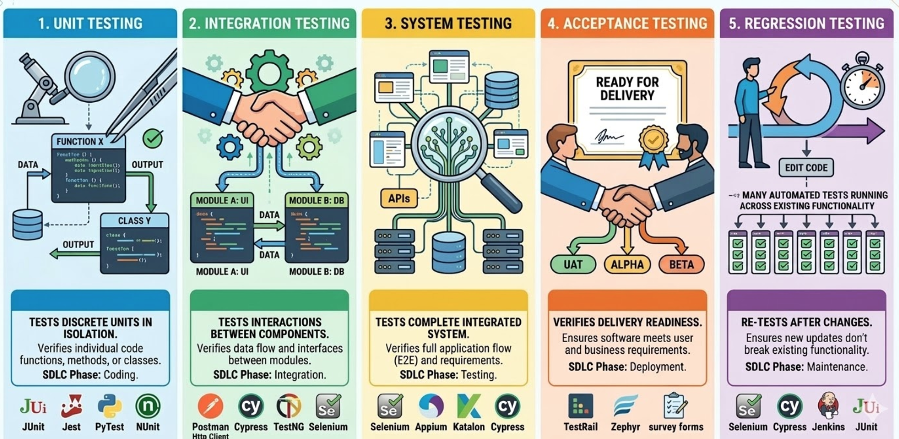
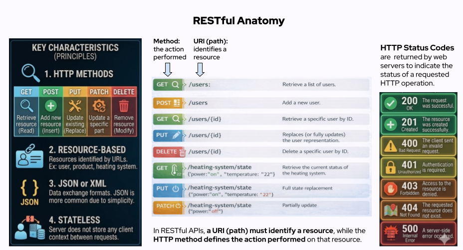
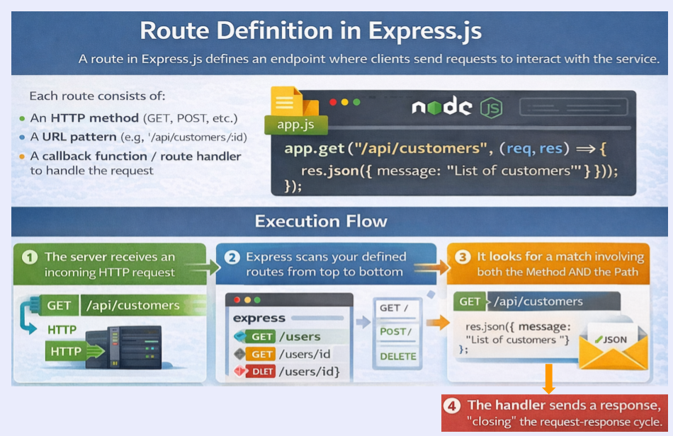

# Module 4: Integration Testing of RESTful APIs
<!-- TOC -->
* [Module 4: Integration Testing of RESTful APIs](#module-4-integration-testing-of-restful-apis)
  * [1. Integration Testing](#1-integration-testing)
  * [2. Fundamentals Of Web Services](#2-fundamentals-of-web-services)
    * [Service-Oriented Architecture (SOA)](#service-oriented-architecture-soa)
      * [Key Characteristics of SOA:](#key-characteristics-of-soa)
      * [Simple Two-Service Communication Diagram](#simple-two-service-communication-diagram)
      * [API Communication Protocols](#api-communication-protocols)
    * [What is a RESTful API?](#what-is-a-restful-api)
      * [HTTP Status Codes](#http-status-codes)
      * [Response Formats](#response-formats)
  * [3. Developing RESTful Endpoints Using NodeJS](#3-developing-restful-endpoints-using-nodejs)
    * [Node.js](#nodejs)
    * [NPM (Node Package Manager)](#npm-node-package-manager-)
    * [Route definition in Express.js](#route-definition-in-expressjs)
    * [A simple Node.js-based RESTful API](#a-simple-nodejs-based-restful-api)
    * [REST Clients - Testing REST api using cURL and HTTP Client](#rest-clients---testing-rest-api-using-curl-and-http-client)
    * [Routers and Routes in Express.js](#routers-and-routes-in-expressjs)
    * [Running Node.js apps as service using pm2](#running-nodejs-apps-as-service-using-pm2)
    * [Deploy app to a server](#deploy-app-to-a-server)
  * [4. Integration Testing with IntelliJ HTTP Client](#4-integration-testing-with-intellij-http-client)
  * [**Hands-on Exercise 1**](#hands-on-exercise-1)
  * [**Hands-on Exercise 2**](#hands-on-exercise-2)
  * [5. Testing Web Applications with Testing Frameworks](#5-testing-web-applications-with-testing-frameworks)
    * [5.1 Jest](#51-jest)
    * [5.2 Supertest](#52-supertest)
  * [**Hands-on Exercise 3: Automated Testing With The Jest and SuperTest for the Bank Account REST API Developed in Module 4 Exercise 1**](#hands-on-exercise-3-automated-testing-with-the-jest-and-supertest-for-the-bank-account-rest-api-developed-in-module-4-exercise-1)
    * [5.3 Test Coverage](#53-test-coverage)
  * [6. Case Study: Integration Testing of REST APIs with Database Support](#6-case-study-integration-testing-of-rest-apis-with-database-support)
    * [4. Extending the Scenario: Service-Based Testing](#4-extending-the-scenario-service-based-testing)
  * [7. Role of Mocking in Testing](#7-role-of-mocking-in-testing)
    * [Mocking a Database?](#mocking-a-database)
<!-- TOC -->


## 1. Integration Testing


Integration testing verifies the interactions between different modules or services within an application.
It focuses on the problems that arise from the integration of modules.



* Why Is Integration Testing Important?

  * Validates the interaction between different parts of the system (e.g., API, database, client).

  * Detects issues that arise when components are combined.

  * Ensures that the system behaves correctly in real-world scenarios. 
    * Covers the entire flow of a feature or functionality.
    * Simulates actual usage of the system.


---  

## 2. Fundamentals Of Web Services


### Service-Oriented Architecture (SOA)

**Service-Oriented Architecture (SOA)** is an architectural pattern in which software components are structured as
independent services.

Each service performs a specific business function and communicates with other services through standardized interfaces
and language-agnostic protocols, typically over HTTP or messaging queues.

For instance; in a banking system, separate services may handle account management, fund transfers, and customer notifications, all interacting through service interfaces.

#### Key Characteristics of SOA:
- **Loose Coupling**: Services are designed to be independent, minimizing dependencies.
- **Interoperability**: Services can work across different platforms and technologies.
- **Reusability**: Services can be reused in different applications.
- **Scalability**: Services can be scaled independently based on demand.

#### Simple Two-Service Communication Diagram

```plaintext
+----------------+       HTTP/Message Queue       +----------------+
|  Service A     | <----------------------------> |  Service B     |
| (Client)       |                                | (Provider)     |
+----------------+                                +----------------+
```
In this diagram:

* Service A acts as a client (consumer) that sends a request to Service B.
* Service B processes the request and sends back a response to Service A.
* Communication between web services can be achieved using HTTP-based protocols such as REST and SOAP, remote procedure
  call (RPC) frameworks like gRPC or XML-RPC, or asynchronous messaging systems such as Apache Kafka or RabbitMQ.


#### API Communication Protocols

**RESTful APIs**

- Based on **REST (Representational State Transfer)** principles.
- Uses standard **HTTP methods** (GET, POST, PUT, DELETE).
- Data format: **JSON**, sometimes XML.
- Stateless, lightweight, and widely used for web applications.

**SOAP (Simple Object Access Protocol)**

- A **protocol** for exchanging structured information in web services.
- Uses **XML** for message format.
- Operates over multiple transport protocols (HTTP, SMTP, etc.).
- Supports **WS-Security** for enterprise-level security.

**XML-RPC (XML Remote Procedure Call)**

- A protocol that allows remote function execution using **XML over HTTP**.
- Simpler than SOAP but less flexible than REST.
- Mainly used for legacy systems requiring XML-based communication.

**gRPC (Google Remote Procedure Call)**

- A **high-performance** framework developed by Google.
- Uses **Protocol Buffers (protobufs)** for efficient, compact data serialization.
- Supports **bidirectional streaming** and **multiplexing**.
- Ideal for **microservices** and **high-speed communication** across distributed systems.


---

### What is a RESTful API?


REST (Representational State Transfer) is an architectural style (or a set of principles) for designing networked applications.

RESTful refers to web services that adhere to the principles of REST (Representational State Transfer).

RESTful is an approach for building scalable, stateless web APIs that use standard HTTP methods and principles.

</img>

**Key Characteristics**

1. **HTTP Methods**: RESTful APIs use standard HTTP methods to perform operations on resources:

   | **HTTP Method** | **Usage** |
      |---------------|---------|
   | `GET`        | Retrieve resource (Read) |
   | `POST`       | Add new resource (Insert) |
   | `PUT`        | Update existing resource (Replace) |
   | `PATCH`      | Update a specific part of resource (Modify) |
   | `DELETE`     | Remove resource |

2. **Resource-Based**: RESTful APIs use resources, which are identified by URLs.
   A resource could be a user, a product, or a function to control a heating system.

3. **JSON or XML**: Data is typically exchanged in JSON or XML format, with JSON being more common due to its
   simplicity and ease of use.

4. **Stateless**: The server does not store any client context between requests.

**Example Endpoints**

- **GET /users**: Retrieve a list of users.
- **POST /users**: Add a new user.
- **GET /users/{id}**: Retrieve a specific user by ID.
- **PUT /users/{id}**: Replaces (or fully updates) the user representation.
- **DELETE /users/{id}**: Delete a specific user by ID.
- **GET /heating-system/state**: Retrieve the current status of the heating system.
- **PUT /heating-system/state {"power":"on", "temperature":"22"}** : Full state replacement
- **PATCH /heating-system/state {"power":"off"}**: Partially update

>***In RESTful APIs, a URI (path) must identify a resource, while the HTTP method defines the action performed on that resource.***

---

#### HTTP Status Codes
HTTP Status Codes are 3-digit numbers returned by web servers to indicate the status of a requested HTTP operation
(successful, failed, not found, etc.).

Here are some common status codes and their meanings:

| **Status Code**       | **Meaning**                          |
|------------------------|--------------------------------------|
| **200 OK**             | The request was successful.          |
| **201 Created**        | The resource was created successfully.|
| **400 Bad Request**    | The client sent an invalid request.  |
| **401 Unauthorized**   | Authentication is required.          |
| **403 Forbidden**      | Access to the resource is denied.    |
| **404 Not Found**      | The requested resource does not exist.|
| **500 Internal Server Error** | A server-side error occurred.     |

---

#### Response Formats
APIs typically return data in one of the following formats:

**JSON (JavaScript Object Notation)**

- **Description**: A lightweight, human-readable, and easy-to-parse format.
- **Usage**: Commonly used in modern APIs.
- **Example**:
```json
  {
    "id": 1,
    "name": "John Doe",
    "email": "john.doe@example.com"
  }
```

**XML**

```xml
<user>
  <id>1</id>
  <name>John Doe</name>
  <email>john.doe@example.com</email>
</user>
```

---

## 3. Developing RESTful Endpoints Using NodeJS

### Node.js

Node.js is an open-source, cross-platform runtime environment that allows you to run JavaScript code on the server side. 
It uses the V8 JavaScript engine, which is also used by Google Chrome, to execute code outside of a web browser.

Key Features of Node.js:

    Asynchronous and Event-Driven: Node.js uses an event-driven, non-blocking I/O model, making it efficient and suitable for real-time applications.
    Single-Threaded: Despite being single-threaded, Node.js can handle many connections concurrently thanks to its event loop.
    NPM (Node Package Manager): Node.js comes with NPM, which is the largest ecosystem of open-source libraries in the world.
    Scalability: Node.js is designed to build scalable network applications.


Use Cases:

    Web Servers: Building fast and scalable web servers.
    APIs: Creating RESTful APIs for web and mobile applications.
    Real-Time Applications: Developing chat applications, online gaming, and collaborative tools.

**For the details of Node.js, refer to https://www.w3schools.com/nodejs/**

---

### NPM (Node Package Manager) 
it is a package manager for JavaScript, and it is the default package manager for Node.js. 
It allows developers to install, share, and manage dependencies (libraries and tools) for their projects.

* Key Features of NPM:
  - Package Management: Easily install and manage third-party libraries and tools. 
  - Version Control: Keep track of different versions of packages to ensure compatibility.
  - Dependency Management: Automatically handle dependencies required by installed packages.
  - Script Running: Define and run scripts for various tasks, such as building, testing, and deploying applications.
* Basic Commands:
  - npm init: Initialize a new Node.js project. 
  - npm install <package>: Install a package and add it to the project's dependencies. 
  - npm update: Update all installed packages to their latest versions. 
  - npm run: Run a script defined in the package.json file.


[Node.js & npm Installation](https://github.com/cllckn/software-testing/tree/main/module1#2-nodejs-for-web-development)

---

### Route definition in Express.js

A **route** in Express.js defines an endpoint where clients send requests to interact with the service.

</img>

Each route consists of:

1. **An HTTP method** (GET, POST, etc.)
2. **A URL pattern** (e.g., `/api/customers/:id`)
3. **A callback function / route handler** to handle the request

Example of a simple route in Express.js:

**Code Example**

```javascript
app.get("/api/customers", (req, res) => {
    res.json({ message: "List of customers" });
});
```

**Execution Flow**

When a request enters your Express application, it follows this sequence:

1) The server receives an incoming HTTP request.
2) Express scans your defined routes from top to bottom.
3) It looks for a match involving both the Method AND the Path.
4) Once matched, it executes the handler function.
5) The handler sends a response, "closing" the request-response cycle.


---

### A simple Node.js-based RESTful API

>**[Code Example:(./simple-restful/server.js)](./simple-restful/server.js)**


**Endpoints (Routes) of the developed API**

        GET http://localhost:3000/api/products

        GET http://localhost:3000/api/products/1

        POST http://localhost:3000/api/products
        Content-Type: application/json
        {
        "name": "HDD",
        "price": 299.99
        }

        PUT http://localhost:3000/api/products/2
        Content-Type: application/json
        {
        "name": "SSD",
        "price": 550.00
        }
    
        DELETE http://localhost:3000/api/products/1


---

### REST Clients - Testing REST api using cURL and HTTP Client


**cURL**
    curl --version
    if not installed -> Download cURL from: https://curl.se/windows/


```sh
# Retrieves a list of all products from the database.

curl -X GET http://localhost:3000/api/products

# -i - Include response headers
# -X - Specify HTTP method
# -H - Add headers
# -d - Send data (POST/PUT)
# -u - Basic authentication
# -v - Verbose(detailed) output

---

# Fetches details of a specific product using its ID.

curl -iX GET http://localhost:3000/api/products/1

---

# Adds a new product to the database. The request body must contain name and price in JSON format.

curl -iX POST http://localhost:3000/api/products \
     -H "Content-Type: application/json" \
     -d '{"name": "HDMI Cable", "price": 50.05}'


---

# Updates the details of an existing product using its ID.

curl -X PUT http://localhost:3000/api/products/1 \
     -H "Content-Type: application/json" \
     -d '{"name": "Updated Product", "price": 1099.99}'


---

# Updates the details of an existing product using its ID. Any missing fields will retain their previous values.

curl -X PATCH http://localhost:3000/api/products/1 \
     -H "Content-Type: application/json" \
     -d '{"price": 1099.99}'
---

# Deletes a product from the database by specifying its ID.

curl -X DELETE http://localhost:3000/api/products/1


```

---

**HTTP Client**

>**[Code Example:(./simple-restful/restful-api-test.http)](./simple-restful/restful-api-test.http)**

---

### Routers and Routes in Express.js

An **Express Router** helps organize routes by grouping them into separate files. 
This makes the code modular, manageable, and scalable.

Benefits of Using a Router

* Code organization – Keeps the project clean and structured.
* Reusability – Routes can be modular and reusable across different parts of the application.
* Easier maintenance – Adding new routes does not clutter the main server file.

>**[Code Example:(./router/server.js)](./router/server.js)**

>**[Code Example:(./router/routes/product.js)](./router/routes/product.js)**


---

### Running Node.js apps as service using pm2
PM2 is a popular, open-source, production-grade process manager for Node.js applications. It helps you manage and keep your 
Node.js applications running in the background, even after system reboots or crashes.
```shell
npm install pm2@latest -g

pm2 start web-app-server.js

pm2 status

pm2 monit

pm2 restart id/name

pm2 stop id/name

pm2 delete id/name

pm2 save # Freeze a process list on reboot via

pm2 startup  #This command will generate a script that you can copy and paste into your terminal to enable PM2 to start on boot.
 

pm2 unstartup systemd  # Remove init script
```

**Starting the same node app as two separate instances with different ports using PM2.**

>**[Code Example:(./pm2/server.js)](./pm2/server.js)**


```shell
# for linux/mac
PORT=4000 pm2 start server.js --name "my-dev-server"
PORT=5000 pm2 start server.js --name "my-test-server"

# for windows
$env:PORT=4000; pm2 start server.js --name "my-dev-server"
$env:PORT=5000; pm2 start server.js --name "my-test-server"

pm2 status
```

**Define env variable for rest api to switch between testing environments**

* ./pm2/http-client.env.json

```json
{
  "dev-server": {
    "hosturi": "http://localhost:4000"
  },
  "test-server": {
    "hosturi": "http://localhost:5000"
  }
}
```

>**[To Test](./pm2/restful-api-test.http)**


---

### Deploy app to a server

    Intellij -> Tools -> Deployment -> Configuration 
    Provide protocol -> sftp, socket address -> 192.2.2.1:22, credentials ->username:password
    Right Click -> Deploy

---

## 4. Integration Testing with IntelliJ HTTP Client

* client.test() -> This function is used to define a test case

```javascript
client.test(testName, function() {
    // Test logic and assertions go here
});

```
* client.assert() -> This function is used to perform assertions
```javascript
client.assert(condition, failureMessage);
```


**Code Example:**

* Write tests for [this Rest API](./simple-restful/server.js)


* ./http-client-test/http-client.env.json

```json
{
  "local": {
    "hosturi": "http://localhost:3000"
  }
}
```

* [http client tests](./http-client-test/restful-api-test.http)

**Key Explanations**

client.test:

    Defines a test case. The first argument is the test name, and the second argument is a function containing assertions.

client.assert:

    Used to assert conditions. If the condition is false, the test fails, and the provided error message is displayed.

response.status:

    Represents the HTTP status code returned by the server. For example:

        200 for successful GET requests.

        201 for successful POST requests-for example; adding a new resource.

        400 for bad requests.

response.headers.valueOf:

    Retrieves the value of a specific response header. For example:

        Content-Type: application/json; charset=utf-8 ensures the response is in JSON format.

response.body:

    Represents the parsed response body (usually JSON). You can access specific fields like id, name, and price.

        Array.isArray(response.body):

            Checks if the response body is an array. Useful for endpoints that return lists of items.

        response.body.length > 0:

            Ensures the array in the response body is not empty.

response.body.message:

    Used to check the message returned by the server, such as confirmation of deletion.

**Why These Assertions Are Important**

Status Codes:

    Ensure the server responds with the correct HTTP status code (e.g., 200 for success, 201 for creation, 400 for errors).

Headers:

    Verify that the response is in the expected format (e.g., JSON).

Response Body:

    Validate the structure and content of the response to ensure the API behaves as expected.

Error Handling:

    Ensures the API handles invalid requests or missing data correctly.


---

## **Hands-on Exercise 1**

## **Hands-on Exercise 2**

---


## 5. Testing Web Applications with Testing Frameworks


### 5.1 Jest
[Jest](https://jestjs.io/) is a JavaScript testing framework developed by Meta.

It is widely used for testing **Node.js, React, and other JavaScript applications**.

It requires zero config to get started and includes everything you need in one package.

**Key Features**
- **Fast and isolated tests** – Each test runs independently.
- **Built-in assertions** – No need for additional assertion libraries.
- **Mocking capabilities** – Can mock functions, modules, and timers.
- **Code coverage** – Generates reports to track untested code.


**Install**
```bash
# Since jest and supertest are testing tools, they are only required during 
# development and should not be included in the final production build.
npm install --save-dev jest
```

**Run tests**
```bash
npx jest              # run all tests
npx jest --watch      # re-run on file changes
npx jest --coverage   # show code coverage report
```

**File naming conventions**
Jest automatically picks up files matching:
```
*.test.js
*.spec.js
__tests__/*.js
```

**Basic structure**

**Code Example:./first-jest-test/simple.jest.test.js**
```js
describe("sum", () => {
  it("adds two positive numbers", () => {
    expect(1+2).toBe(3);
  });

  it("returns 0 when both inputs are 0", () => {
    expect(5*4).toBe(20);
  });
});
```

**package.json integration**
```json
{
  "scripts": {
    "test": "jest"
  }
}
```
Then just run `npm test` or `npm run test`.


**Jest core methods**

**Test structure**
- `describe(name, fn)` — groups related tests into a suite
- `it(name, fn)` / `test(name, fn)` — defines a single test case (identical)
- `beforeEach / afterEach` — runs before/after every test in the block
- `beforeAll / afterAll` — runs once before/after the whole suite

**Assertions (`expect`)**
- `toBe(val)` — strict equality (`===`), for primitives
- `toEqual(val)` — deep equality, for objects/arrays
- `toBeTruthy()` / `toBeFalsy()` — loose truthy/falsy check
- `toBeNull()` / `toBeUndefined()` / `toBeDefined()`
- `toContain(item)` — array or string contains a value
- `toHaveLength(n)` — checks `.length`
- `toThrow()` — expects a function to throw
- `toMatch(regex)` — string matches a pattern

**Negation**
- `.not` — inverts any matcher: `expect(x).not.toBe(null)`

**Mocks**
- `jest.fn()` — creates a mock function
- `jest.spyOn(obj, 'method')` — wraps an existing method to track calls
- `.toHaveBeenCalled()` / `.toHaveBeenCalledWith(args)` — assert on mock calls
- `jest.mock('module')` — auto-mocks an entire module

**Skipping & focusing**
- `it.skip(...)` / `describe.skip(...)` — skips a test without deleting it
- `it.only(...)` / `describe.only(...)` — runs only that test/suite


---

### 5.2 Supertest


[Supertest](https://www.npmjs.com/package/supertest) tests HTTP endpoints in Node.js by wrapping your Express app
and firing real requests without starting a server.


>Supertest handles opening and closing the connection per request
>automatically. No need for `app.listen()` in your test files —
>just export the bare `app` and pass it to `request()`.
 

**Install**
```bash
# Since jest and supertest are testing tools, they are only required during 
# development and should not be included in the final production build.
npm install --save-dev supertest
```


**Setup**

```js
const request = require("supertest");
const app = require("../app"); // your Express app
```

**Making requests**

```js
request(app).get("/path")
request(app).post("/path").send({ key: "value" })
request(app).put("/path").send({ key: "value" })
request(app).delete("/path")
```

**Chaining options**

```js
.send({ key: "value" })                    // request body (JSON by default)
.set("Authorization", "Bearer token")      // set a header
.query({ page: 1 })                        // add query string params
.attach("file", "./file.png")              // multipart file upload
```

**Asserting the response**

```js
const res = await request(app).get("/");

res.statusCode   // e.g. 200
res.body         // parsed JSON body
res.headers      // response headers
res.text         // raw response string
```

**Using with Jest**

```js
expect(res.statusCode).toBe(200);
expect(res.body).toEqual({ message: "Hello, world!" });
```


**jest&supertest code examples**

>[Code Example:(./first-jest-test/server.js)](./first-jest-test/server.js)

>[To test:(./first-jest-test/server.test.js)](./first-jest-test/server.test.js)


## **Hands-on Exercise 3: Automated Testing With The Jest and SuperTest for the Bank Account REST API Developed in Module 4 Exercise 1**

***


### 5.3 Test Coverage

A quantitative measure of the amount of source code executed during automated testing.

It shows how much of your source code is executed (or "hit") by your tests.

Maintaining a good level of code coverage is important as it helps identify untested parts of the code, reduces the 
risk of bugs, and improves overall software reliability.

However, achieving 100% coverage can be expensive in terms of time, effort, and resources. Instead, focusing on 
critical functionalities is often more practical.

It's typically expressed as a percentage. Different types of coverage measurements exist, including:

* Statement Coverage – Percentage of code statements executed.

* Branch Coverage – Percentage of decision branches (e.g., if-else, switch) tested.

* Function Coverage – Percentage of functions/methods called in tests.

* Line Coverage – Percentage of lines of code executed.

* Uncovered Line #s:
  * Lists the line numbers of code that were not executed during the tests.


Achieving 100% coverage can be expensive in terms of time, effort, and resources.
Instead, focusing on critical functionalities is often more practical.

* Prioritize Critical Code – Focus on business logic, edge cases, error handling, and high-risk areas.
* Avoid Redundant Tests – Testing trivial code (e.g., getters/setters) adds little value.


To generate a coverage report, you need to configure Jest to collect coverage information.
Add the following lines into the package.json.

```json
{
  "scripts": {
    "test": "jest",                          
    "test:coverage": "jest --coverage"      
  },
  "jest": {
    "coverageReporters": ["text", "html"],   
    "coveragePathIgnorePatterns": ["/node_modules/"]  
  }
}
```

**Explanation:**

```json
{
  "scripts": {
    "test": "jest",                          // Run the test suite
    "test:coverage": "jest --coverage"       // Run tests and generate a coverage report
  },
  "jest": {
    "coverageReporters": ["text", "html"],   // Print a summary table to the terminal + save an HTML report to /coverage
    "coveragePathIgnorePatterns": ["/node_modules/", "/config/"]  // Exclude third-party packages and config files from coverage stats
  }
}
```

run:
```shell
npm run test:coverage
```


**Example**

* modify the previous example /first-jest-test/server.js to generate a coverage report.
  * generate the code coverage report
  * skip(it.skip) post endpoint tests 
  * regenerate the code coverage report


## 6. Case Study: Integration Testing of REST APIs with Database Support

**Instead of the real one, using a test database for testing helps protect the main database from unintended 
modifications and accidental data corruption.**

---

**1. Construct Database Structures**

* Define two new databases named `stdb` and `sttestdb`
* Construct new tables named `products` in these databases:
```sql
create database stdb;

create database sttestdb;

create table public.products
(
    id    serial primary key,
    name  text           not null,
    price numeric(10, 2) not null
);


insert into products (name, price)
values ('SSD',600),
       ('RAM',400);

```

---

**2. Develop the Application**

>[Code Example:(./restapi-with-db/server.js)](./restapi-with-db/server.js)


---

**3. Write and Execute Integration Tests**

To test the provided REST API:
1. **Start the Express server** with a test database connection.
2. **Use SuperTest** to make HTTP requests to API endpoints.
3. **Check database changes** after performing operations.
4. **Validate HTTP responses** and error handling.

**Required Dependencies**


**Test File Structure**
- `./restapi-with-db/server.js` → Main Express server with PostgreSQL connection.
- `~/test/~/restapi-with-db/server.test.js` → Integration tests for API endpoints.

**API Endpoints to Test**
The tests will verify:
- **GET /api/products** → Fetch all products.
- **GET /api/products/:id** → Fetch a single product.
- **POST /api/products** → Add a new product.
- **PUT /api/products/:id** → Update an existing product.
- **DELETE /api/products/:id** → Remove a product.

Each test should:

* Simulate an API request using supertest.
* Validate the response status code and data.
* Clean up the database after each test to ensure isolation.


**Install Dependencies**
Run the following command to install the required packages:

    npm install --save-dev jest supertest pg

**Implement Integration Tests**

>[To test:(~/test/.../restapi-with-db/server.test.js)](~/test/.../restapi-with-db/server.test.js)

* Execute the tests using the following script, after configuring jest in the package.json:

>npm run test:coverage


### 4. Extending the Scenario: Service-Based Testing

To apply real-world integration testing:

1. Develop a separate client service 
  - A simple client service that consumes the REST API with DB `./restapi-with-db/server.js`.
  - This service retrieves products and allows modifications.


>[Code Example:(./restapi-with-db/client-service.js)](./restapi-with-db/client-service.js)

2. **Test API Consumption**

>[To test:(~/test/.../restapi-with-db/client.service.test.js)](~/test/.../restapi-with-db/client.service.test.js)


## 7. Role of Mocking in Testing


**What is Mocking?**

Mocking is the process of simulating fake implementations of modules,
functions, or dependencies to test components in isolation.

- **Avoid dependency on external systems** (e.g., databases, APIs).
- **Increase test speed and reliability** by replacing slow operations.
- **Control test scenarios** by returning predefined responses.

### Mocking a Database?

When testing a Node.js module that interacts with a database:

- A real database connection may introduce **instability** due to network issues.
- The database may **not always have the expected test data**.
- Setting up and tearing down a test database can be **time-consuming**.

**By mocking the database, business logic is tested independently of the database.**

---

**Jest Mock Example for PostgreSQL Pool**

>[Code Example:(./mocking/service.js)](./mocking/service.js)
 
>[To test:(~/test/.../mocking/service.test.js)](~/test/.../mocking/service.test.js)

* Break the price validation logic to see a fail in test.
