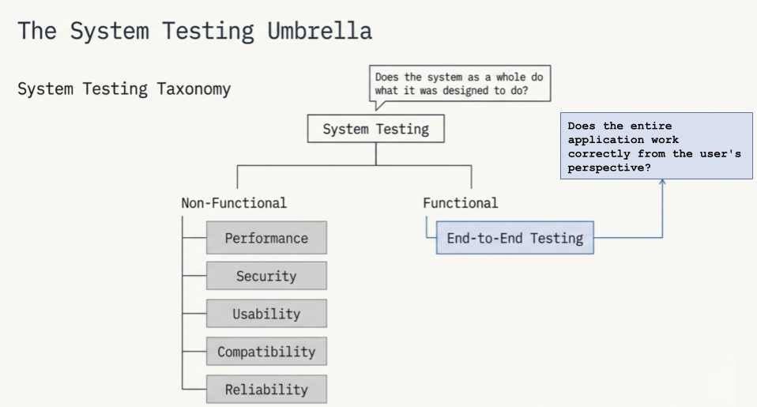
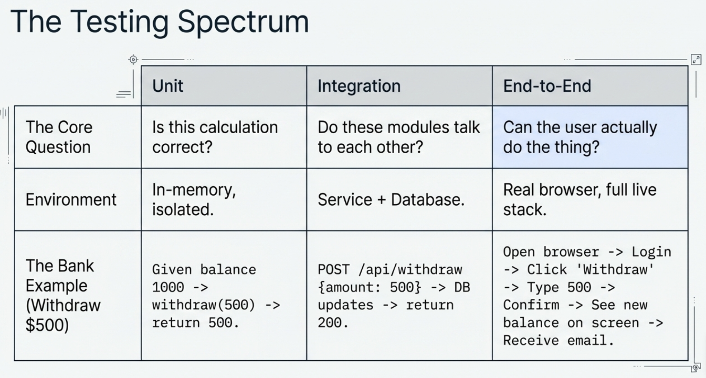
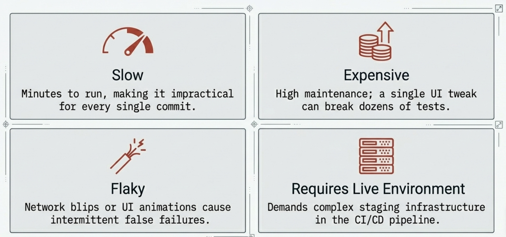
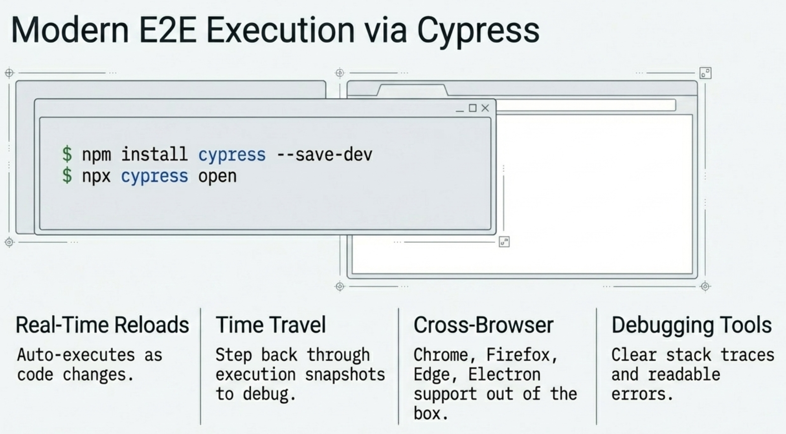

# Module 5: Introduction To End-To-End Testing

<!-- TOC -->
* [Module 5: Introduction To End-To-End Testing](#module-5-introduction-to-end-to-end-testing)
  * [1. System Testing](#1-system-testing)
  * [2. What Is End-to-End Testing?](#2-what-is-end-to-end-testing)
  * [3. How E2E Testing Differs From the Others](#3-how-e2e-testing-differs-from-the-others)
    * [Unit Testing Revisited](#unit-testing-revisited)
    * [Integration Testing Revisited](#integration-testing-revisited)
    * [Regression Testing Revisited](#regression-testing-revisited)
    * [E2E Testing](#e2e-testing)
  * [4. Challenges of E2E Testing](#4-challenges-of-e2e-testing)
  * [5. E2E Testing Via Cypress](#5-e2e-testing-via-cypress)
  * [6. Writing Cypress Tests](#6-writing-cypress-tests)
    * [Case Study: E2E Testing of a Sample Web Application](#case-study-e2e-testing-of-a-sample-web-application)
<!-- TOC -->


## 1. System Testing

System testing is the practice of testing the **complete, integrated application**
as a whole — verifying that it meets its specified requirements. It is conducted
on the fully assembled system, after integration testing, and before the software
is handed over for acceptance testing or released to users.

</img>

> System testing asks: *"Does the system as a whole do what it was designed to do?"*

System testing is a **category**, not a single technique. It is an umbrella that
covers many different types of tests, each targeting a different quality dimension
of the system:

| System Test Type | What It Checks |
|-----------------|---------------|
| **Functional testing** | Does the system do what the requirements say? |
| **Performance testing** | Does it handle load without degrading? |
| **Security testing** | Is it protected against known vulnerabilities? |
| **Usability testing** | Can real users navigate it without confusion? |
| **Compatibility testing** | Does it work across browsers, OSes, devices? |
| **Reliability testing** | Does it recover gracefully from failures? |
| **End-to-End testing** | Do complete user workflows work correctly? |

E2E testing is one of the **functional** sub-types within the system testing umbrella.


So far you have learned three types of testing, each operating at a different level of the system:

- **Unit tests** verify a single class or method in isolation
- **Integration tests** verify that multiple modules work correctly together
- **Regression tests** verify that existing functionality is not broken by new changes

Each of these answers a specific question. But none of them answers the most important question of all:

> *"Does the entire application work correctly from the user's perspective?"*

That is exactly what **End-to-End (E2E) testing** answers.


---

## 2. What Is End-to-End Testing?

End-to-End (E2E) testing validates the **complete flow** of an application—from the user interface through the backend,
database, and external services—ensuring the system behaves as expected from a real user's perspective.

It simulates user interactions with the application and verifies that all integrated components work together correctly.

**Key Characteristics of E2E Testing**

**Simulates real user scenarios** — tests are written from the user's point of view,
not the developer's. A user does not call a Java method; they click a button.

**Verifies the full technology stack** — frontend, backend, database, and external
services all participate in a single test run.

**Catches what other tests cannot** — a unit test and an integration test can both
pass while an E2E test fails, because the failure lives in the connection between
layers that neither test individually covered.

**Runs against a real or realistic environment** — E2E tests need the application
to be running, which is why they are typically executed in a staging environment
rather than on every commit.

## 3. How E2E Testing Differs From the Others



### Unit Testing Revisited

A unit test for a bank account service might look like this in concept:

```
Given a balance of 1000
When  I withdraw 500
Then  the balance should be 500
```

This test runs entirely in memory. There is no database, no HTTP request, no UI. It only
verifies the logic inside a single method. It tells you the calculation is correct —
but it cannot tell you whether a real user can actually withdraw money through the application.

### Integration Testing Revisited

An integration test goes further:

```
Given a POST request to /api/accounts/1/withdraw with { amount: 500 }
When  the request reaches the service and the database
Then  the response should be 200 and the balance updated in the DB
```

This verifies that the controller, service, and database work together. But it still does
not involve a real browser, a real UI, or a real user flow spanning multiple steps.

### Regression Testing Revisited

A regression test re-runs a test that previously passed to confirm a new change has not
broken it. It is a **strategy** — regression tests can be unit, integration, or E2E tests.
The distinction is their purpose: protecting existing, known-good behaviour.

### E2E Testing

An E2E test for the same feature looks entirely different:

```
Given the user opens the browser and navigates to http://localhost:3000
When  they log in with valid credentials
And   navigate to their account page
And   click "Withdraw" and enter 500
And   confirm the transaction
Then  the new balance of 500 should be displayed on screen
And   a confirmation email should be received
```

This test exercises:
- The browser and UI rendering
- The HTTP request from the frontend
- The backend REST API
- The database write
- The email service

No mock, no stub, no shortcut — the entire system runs exactly as it would in production.


## 4. Challenges of E2E Testing



**Slow** — a single E2E test can take seconds or minutes, compared to milliseconds for a unit test.
A full E2E suite can take tens of minutes to run, making it impractical on every commit.

**Flaky** — E2E tests depend on the entire stack. A network blip, a slow database response,
or an animation that takes slightly longer than expected can cause a test to fail
intermittently — even though the application itself is fine.

**Expensive to maintain** — when the UI changes, E2E tests often need to be rewritten.
Because they touch so many layers, a single application change can break many tests at once.

**Require a running environment** — unlike unit or integration tests that run in isolation,
E2E tests need the full application stack to be live, which adds infrastructure complexity
to your CI/CD pipeline.


## 5. E2E Testing Via Cypress

Cypress is a modern JavaScript-based testing framework specifically designed for web applications.
It is primarily used for E2E testing but also supports integration and unit tests.




**Key Features of Cypress:**
1. **Real-Time Reloads:** Automatically reloads tests as you make changes.
2. **Time Travel:** Allows you to step back through test execution to debug.
3. **Cross-Browser Testing:** Supports Chrome, Firefox, Edge, and Electron.
4. **Debugging Tools:** Provides detailed error messages and stack traces.


## 6. Writing Cypress Tests

**Installation**
Ensure you have Node.js installed, then install Cypress via npm:

```sh
npm install cypress --save-dev
```

**Opening Cypress**
* Go to project's test folder and open cypress
```sh
cd test/module5
npx cypress open
```
* configure cypress (E2E testing, Configuration files -> continue, Start E2E testing in X(Chrome), create new spec -> create spec , Okay...)
* go to /cypress/e2e/
* write tests in *.cy.js files
* run tests


**Reopening Cypress**
* Go to cypress's root folder - the directory where `cypress.config.js` is located.
```sh
npx cypress open
```
* run tests


**To run all the tests at once**
* Go to cypress's root folder - the directory where `cypress.config.js` is located.
    ```shell
    npx cypress run
    ```

### Case Study: E2E Testing of a Sample Web Application

1. [Download and install the application](./app) and run it.

2. Copy the following cypress config file `cypress.config.js` into the cypress testing folder (i.e. ~/test/.../).

>**Code Example:(~/test/.../cypress.config.js)**

```javascript
// cypress.config.js
// ─────────────────────────────────────────────────────────────────────────────
// Central configuration file for Cypress.
// Cypress reads this file automatically at startup — no import or flag needed.
// ─────────────────────────────────────────────────────────────────────────────

// defineConfig() is a helper provided by Cypress that enables IntelliSense
// (auto-complete and type checking) in your editor.
// It does not change runtime behaviour — it is a quality-of-life wrapper.
const { defineConfig } = require("cypress");

module.exports = defineConfig({

  // e2e: contains all configuration specific to End-to-End testing mode.
  // Cypress also supports "component" testing (for React/Vue components),
  // which would live in a separate "component: {}" block.
  e2e: {

    // baseUrl: the root URL Cypress prepends to every cy.visit() and cy.request() call.
    // cy.visit("/")          → resolves to http://localhost:3000/
    // cy.visit("/welcome")   → resolves to http://localhost:3000/welcome
    // Must match the PORT your Express server is listening on (server.js line: PORT = 3000).
    // Change this to http://localhost:4000 if you run the server on a different port.
    baseUrl: "http://localhost:3000",

    // specPattern: glob pattern that tells Cypress where to look for test files.
    // **   → any subdirectory depth inside cypress/e2e/
    // *    → any filename
    // .cy.js → Cypress convention for E2E test file extension
    // With this pattern, adding a new file like cypress/e2e/signup.cy.js is
    // automatically picked up — no registration needed.
    specPattern: "cypress/e2e/**/*.cy.js",

    // supportFile: path to a file that runs before every test spec.
    // The support file is typically used to define custom Cypress commands
    // (e.g. cy.login()) and global configuration.
    // Set to false here because this demo needs no custom commands —
    // keeping it disabled avoids creating an empty boilerplate file.
    // To enable it, set: supportFile: "cypress/support/e2e.js"
    supportFile: false,

  },
});

````


3. Copy the following test suit file `login.cy.js` into the cypress testing folder (i.e. ~/test/.../cypress/e2e/), and
   run it.

>**Code Example:(~/test/.../cypress/e2e/login.cy.js)**

```javascript
// cypress/e2e/login.cy.js
// ─────────────────────────────────────────────────────────────────────────────
// E2E tests for the login page.
// The server must be running on http://localhost:3000 before Cypress starts.
// Run with:  npx cypress open   (interactive — opens the Cypress Test Runner UI)
//            npx cypress run    (headless   — runs all tests in the terminal)
// ─────────────────────────────────────────────────────────────────────────────

// describe() groups related tests into a named suite.
// All login tests live here so the Cypress UI and terminal output
// show them together under the "Login Page" heading.
describe("Login Page", () => {

  // beforeEach() runs before EVERY individual test in this describe block.
  // Navigating to "/" here means each test always starts from a clean,
  // freshly loaded login page — no leftover state from a previous test.
  beforeEach(() => {
    cy.visit("/"); // Resolves to baseUrl + "/" → http://localhost:3000/
  });

  // ── Happy path ──────────────────────────────────────────────────────────────

  it("login_whenValidCredentialsProvided_redirectsToWelcomePage", () => {
    // cy.get() finds a DOM element using a CSS selector.
    // [data-cy="username"] targets the element with the attribute data-cy="username".
    // "#username" can select the element by id attribute.
    // Using data-cy attributes as selectors is Cypress best practice —
    // they are dedicated test hooks that survive CSS or class name changes.
    cy.get('[data-cy="username"]').type("user");     // .type() simulates keyboard input
    cy.get('[data-cy="password"]').type("password"); // types into the password field
    cy.get('[data-cy="login-btn"]').click();          // .click() simulates a mouse click on the button

    //Select elements using their id attribute
    /*cy.get("#username").type("user");
    cy.get("#password").type("password");
    cy.get("#login-btn").click();*/
    
    // cy.url() reads the current browser URL after the server responds.
    // .should() is an assertion — the test fails if the condition is not met.
    // "include" checks that the URL contains the given substring.
    // After a valid login the server redirects to /welcome, so the URL must include it.
    cy.url().should("include", "/welcome");
  });

  it("login_whenValidCredentialsProvided_displaysWelcomeMessage", () => {
    cy.get('[data-cy="username"]').type("user");
    cy.get('[data-cy="password"]').type("password");
    cy.get('[data-cy="login-btn"]').click();

    // Chain multiple assertions on the same element using .and()
    // "be.visible" — the element exists in the DOM AND is visible to the user (not hidden by CSS)
    // "contain.text" — the element's text content includes the given string
    cy.get('[data-cy="welcome-message"]')
      .should("be.visible")
      .and("contain.text", "Welcome, user!"); // verifies the correct username appears in the heading
  });

  // ── Unhappy paths ───────────────────────────────────────────────────────────

  it("login_whenInvalidPasswordProvided_staysOnLoginPage", () => {
    cy.get('[data-cy="username"]').type("user");
    cy.get('[data-cy="password"]').type("wrongpassword"); // deliberate wrong password
    cy.get('[data-cy="login-btn"]').click();

    // On a failed login the server redirects back to /?error=1.
    // "include" checks that the error query parameter is present in the URL,
    // confirming the browser stayed on the login page rather than reaching /welcome.
    cy.url().should("include", "/?error=1");
  });

  it("login_whenInvalidPasswordProvided_displaysErrorMessage", () => {
    cy.get('[data-cy="username"]').type("user");
    cy.get('[data-cy="password"]').type("wrongpassword");
    cy.get('[data-cy="login-btn"]').click();

    // Target the error banner by its HTML id attribute (#errorBanner).
    // The banner is hidden by default in CSS and becomes visible only when
    // the page loads with ?error=1 in the URL (toggled by JavaScript in index.html).
    cy.get("#errorBanner")
      .should("be.visible")
      .and("contain.text", "Invalid username or password"); // verify the correct error message text
  });

  it("login_whenInvalidUsernameProvided_displaysErrorMessage", () => {
    cy.get('[data-cy="username"]').type("wronguser"); // deliberate wrong username
    cy.get('[data-cy="password"]').type("password");
    cy.get('[data-cy="login-btn"]').click();

    // Only asserting visibility here — the error message text is already
    // covered in the test above, so this test focuses on a different
    // input combination (wrong username instead of wrong password).
    cy.get("#errorBanner").should("be.visible");
  });

  // ── Sign out ────────────────────────────────────────────────────────────────

  it("logout_whenSignOutClicked_redirectsBackToLoginPage", () => {
    // This test covers a multi-step user journey: login → then sign out.
    // Cypress executes each command in sequence and waits for each to complete
    // before moving to the next — no manual waits or callbacks needed.

    // Step 1 — Log in first so we reach the welcome page
    cy.get('[data-cy="username"]').type("user");
    cy.get('[data-cy="password"]').type("password");
    cy.get('[data-cy="login-btn"]').click();
    cy.url().should("include", "/welcome"); // guard: confirm we actually reached /welcome

    // Step 2 — Click the Sign Out link on the welcome page
    cy.get('[data-cy="logout-btn"]').click();

    // Cypress.config("baseUrl") reads the baseUrl from cypress.config.js → "http://localhost:3000"
    // "eq" asserts an exact match — the URL must be exactly the root,
    // not just contain "/", which would also match "/welcome".
    cy.url().should("eq", Cypress.config("baseUrl") + "/");
  });

});
```

4. Copy the following test suit file `welcome.cy.js` into the cypress testing folder (i.e. ~/test/.../cypress/e2e/), and
   run it.

```javascript
// ─────────────────────────────────────────────────────────────────────────────
// cy.request() as a UI bypass helper 
// ─────────────────────────────────────────────────────────────────────────────
//
// Problem: every test that needs to start on the /welcome page must first
// click through the login form. For one test that is fine. For ten tests
// it is slow and fragile — a UI change to the login form breaks unrelated tests.
//
// Solution: use cy.request() to POST the credentials directly to the server,
// then navigate to /welcome. This is faster and bypasses the UI entirely.
// The test below verifies welcome-page behaviour, not login behaviour —
// so skipping the UI login is appropriate here.
//
// Rule of thumb:
//   Use the UI  → when you are testing the login flow itself
//   Use cy.request() → when login is just a prerequisite for testing something else
// ─────────────────────────────────────────────────────────────────────────────

describe("Welcome Page — accessed via cy.request() login bypass", () => {

    beforeEach(() => {
        // cy.request() sends the credentials directly to the server over HTTP —
        // no form fill, no button click, no page render.
        // followRedirect: true (the default) means Cypress follows the 302 automatically,
        // ending up at /welcome — but we do not assert here because we only want the
        // session/cookie to be established. We then navigate with cy.visit().
        cy.request({
            method: "POST",
            url: "/login",
            body: { username: "user", password: "password" },
            form: true, // matches the Content-Type the Express server expects
        });

        // After the request above the server has set any session state.
        // cy.visit() now takes us directly to /welcome without going through the login form.
        cy.visit("/welcome");
    });

    it("welcomePage_whenAccessedAfterLogin_displaysWelcomeMessage", () => {
        // This test is about the welcome page content, not the login process.
        // Using cy.request() in beforeEach means a login form change can never
        // break this test — only a welcome page change can.
        cy.get('[data-cy="welcome-message"]')
            .should("be.visible")
            .and("contain.text", "Welcome, user!");
    });

    it("welcomePage_whenSignOutClicked_redirectsToLoginPage", () => {
        cy.get('[data-cy="logout-btn"]').click();
        cy.url().should("eq", Cypress.config("baseUrl") + "/");
    });

});
```
