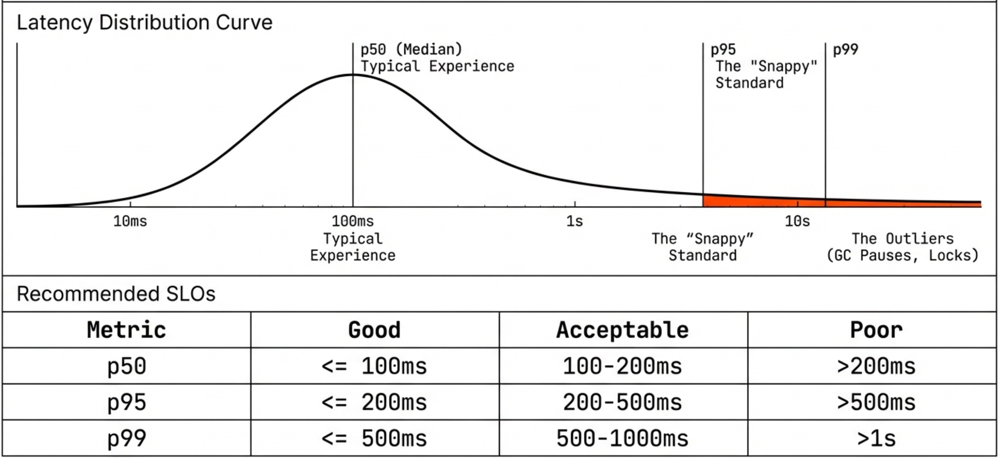
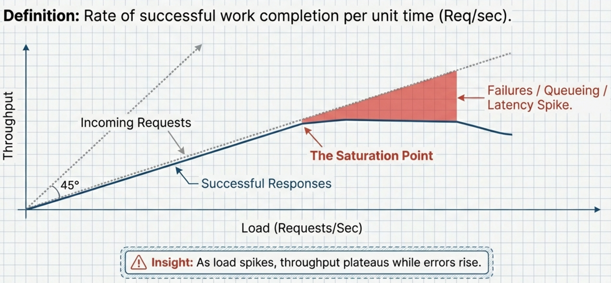
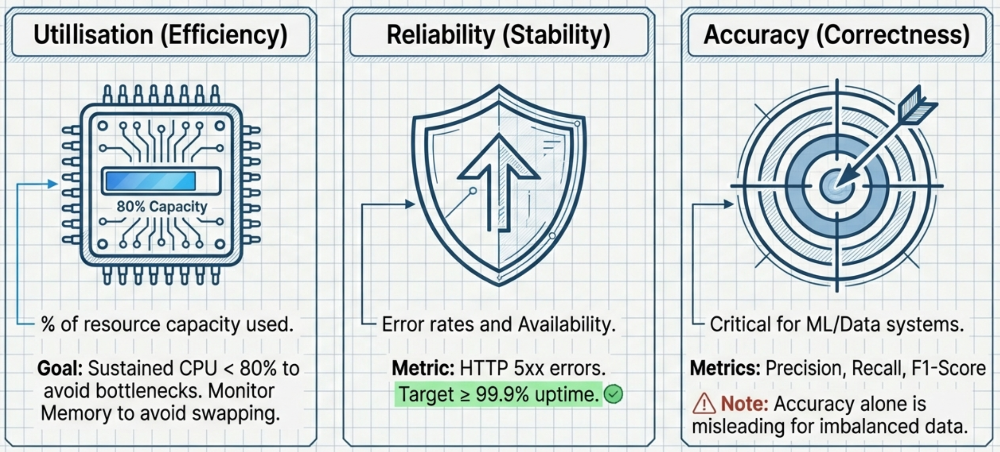

# Module 6: Load and Stress Testing
<!-- TOC -->
* [Module 6: Load and Stress Testing](#module-6-load-and-stress-testing)
  * [Fundamentals of Load and Stress Testing](#fundamentals-of-load-and-stress-testing)
  * [Conducting The First Load Test](#conducting-the-first-load-test)
  * [Some of the Performance Metrics for ICT Systems](#some-of-the-performance-metrics-for-ict-systems)
    * [1. Latency Metrics](#1-latency-metrics)
    * [2. Throughput Metrics](#2-throughput-metrics)
    * [3. Utilisation Metrics](#3-utilisation-metrics)
  * [Load Testing Report Details](#load-testing-report-details)
  * [Generating Test Report](#generating-test-report)
  * [Comparative Analysis of Test Results](#comparative-analysis-of-test-results)
  * [Monitoring Resource Utilisation During Tests](#monitoring-resource-utilisation-during-tests)
  * [Extending load tests](#extending-load-tests)
<!-- TOC -->

## Fundamentals of Load and Stress Testing


**Load Testing:** Simulating realistic user traffic on your application to understand its behavior under expected peak loads. 
This helps identify performance bottlenecks, ensure scalability, and maintain a good user experience.

**Stress Testing:** Pushing your system beyond its normal operating conditions to identify breaking points, understand 
its resilience, and determine its maximum capacity. This helps uncover stability issues and potential failure scenarios.


**Artillery** is a powerful and versatile open-source load testing and stress testing tool written in Node.js. It's designed to be 
easy to use for developers while providing the necessary features for comprehensive performance evaluation of web applications, 
APIs, web sockets, and other backend services.

**The Benefits of Load and Stress Testing:**

* Performance Bottlenecks: Identify system limitations (CPU, memory, disk) that slow down performance.
* Scalability: Determine how many users/transactions the system can handle.
* Stability: Ensure the system remains stable under normal and peak loads.
* Error Detection: Uncover errors that only appear under heavy load (e.g., race conditions-two transactions updating the same row without isolation.).
* Resource Leaks: Help detect memory leaks, which can degrade performance over time.
* System Limits: Determine the system's breaking point and failure behavior.
* Database Performance: Evaluate database query performance and identify bottlenecks.
* Network Capacity: Assess network bandwidth and latency under load.
* Infrastructure Optimization: Provide data for hardware and software capacity planning.
* User Experience: Ensure acceptable response times and a smooth user experience under load.

## Conducting The First Load Test

* Run the application to be tested

```shell
node module5/app/server.js
```


* Install artillery
```shell
npm install --save-dev artillery 
```

* Write a sample load test script (/test/module6/st-load-test-get-10clients-v1.yml)

```yaml
config:
  target: 'http://localhost:3000' # Replace with your application's URL if different
  phases:
    - duration: 30 # Run the test for 30 seconds
      arrivalRate: 10 # Simulate 10 new virtual users arriving per second
  defaults:
    headers:
      Content-Type: 'application/json' # Assuming your API uses JSON

scenarios:
  - name: get login page
    flow:
      - get:
          url: '/' # Test the homepage
```

* Go to /test/module6/ and run the load test
```shell
artillery run st-load-test-get-10clients-v1.yml
```


## Some of the Performance Metrics for ICT Systems


This section summarizes commonly used performance metrics for ICT systems.

In ICT (Information and Communication Technology) systems, performance is measured by more than just speed. To get a
complete picture, you need to look at how resources are consumed, how reliable the data is, and how the system
behaves under pressure.

Here is a summary of the key performance metrics, examples, and best practices.

---

### 1. Latency Metrics

Time taken to complete a single operation. Latency is the "speed" of your system. It measures the delay introduced
by processing and network travel.



| Examples | Usage Example | Best Practices |
|--------|---------------|----------------|
| Average latency | Rough performance overview | Do not rely on averages alone |
| p50 (median) | Typical user experience | Use percentiles for analysis |
| p95, p99 | Tail latency and worst-case delays | Define SLOs (e.g., p95 < 200 ms) |

The Percentile Strategy ($p50, p95, p99$):
* Average latency: Rough performance overview. The average (mean) latency is often unreliable for performance analysis.
  * Some users may experience long delays while average indicates “acceptable performance".

* $p50$ (Median): It's the "average" experience. 50% of your users are faster than this, and 50% are slower.

* $p95$: The "Tail Latency." 95% of requests are faster than this.
  It’s the industry standard for judging if an app feels "snappy/good" for almost everyone.
  It is the gold standard for Service Level Objectives (SLOs)-internal performance targets.

* $p99$: The "Worst Case." 99% of requests are faster than this. If this is high, 1 out of every 100 users is having a
  terrible experience such as Garbage Collection (GC) pauses or heavy database re-indexing (db locking).

**Recommended Latency SLOs (Typical Web Services)**

| Metric | Good | Acceptable | Poor |
|------|------|------------|------|
| **p50 (median)** | ≤ 100 ms | 100–200 ms | > 200 ms |
| **p95** | ≤ 200 ms | 200–500 ms | > 500 ms |
| **p99** | ≤ 500 ms | 500–1000 ms | > 1 s |


* Best Practice: Monitor the spread between $p50$ and $p99$. If the gap grows during a load test, it indicates the
* system is becoming unstable even if the "average" looks okay.


---

### 2. Throughput Metrics

Rate of successful work completion per time unit.



| Examples | Usage Example | Best Practices |
|--------|---------------|----------------|
| Requests per second (req/sec) | Measure the success and capacity of a web service or REST API | Measure sustained throughput; correlate with latency and errors |
| Transactions per second (TPS) | Evaluate database or financial transaction systems | Avoid relying on short bursts |
| Messages per second | Assess message brokers and streaming systems | Test under realistic workloads |
| Mbps | Network data transfer rate |  |


**For The Case Study:**

* Number of responses completed per unit time.
* Throughput is the actual, measured rate at which data is successfully transferred over a network path from source to
  destination in a given time frame.

>In an ideal world: Request throughput ≈ Response throughput (all requests succeed)
>
>In reality: As load increases, response throughput may plateau or drop while request throughput continues to increase.

> Saturation is confirmed when:
>- Throughput plateaus
>- Latency increases sharply
>- Error rate rises
>- CPU utilization approaches high levels
>
>Do not determine saturation from a single spike.


Artillery latency percentiles are computed only over completed responses; under overload, requests may fail before
completion, causing failure rates to rise while p95/p99 remain deceptively stable.

During the test, as the request rate increased beyond ~724 req/sec, the number of successful responses began to decline
while failures continued to rise. This indicates the system reached and exceeded its saturation point, where it can no
longer process all incoming requests efficiently.


### 3. Utilisation Metrics



Percentage of resource capacity being used.

| Examples | Usage Example | Best Practices |
|--------|---------------|----------------|
| CPU utilisation (%) | Detect CPU bottlenecks in application servers | Keep sustained usage below ~80% |
| Memory usage (GB or %) | Identify memory leaks or insufficient RAM | Avoid swapping |
| Disk I/O utilisation | Evaluate storage performance | Monitor queue length |
| Network bandwidth usage | Detect network saturation | Leave headroom |


## Load Testing Report Details


**HTTP Status Codes**

http.codes.200: ................................................................ 3000
- Indicates that 3000 HTTP responses returned status code 200 (OK), meaning all requests were successful.

**Downloaded Data**

http.downloaded_bytes: ......................................................... 828000
- The total amount of data downloaded during the test was 828,000 bytes (~828 KB), suggesting each response averaged around 276 bytes.

**Request Rate**

http.request_rate: ............................................................. 50/sec
- The server handled 50 requests per second, as defined in your test configuration. This shows the sustained throughput over the duration.

**Total Requests**

http.requests: ................................................................. 3000
- A total of 3000 HTTP requests were made throughout the test.

**HTTP Response Time (All)**

http.response_time:  
min: ......................................................................... 0  
max: ......................................................................... 77  
mean: ........................................................................ 0.7  
median: ...................................................................... 1  
p95: ......................................................................... 1  
p99: ......................................................................... 2
- min: The fastest response took 0 ms, which may include in-memory cached responses or very lightweight endpoints.
- max: The slowest response took 77 ms, which is still quite fast and acceptable for most web applications.
- mean: The average response time was 0.7 ms, indicating the server was highly responsive.
- median: Half of the requests completed in 1 ms or less.
- p95: 95% of the requests completed in 1 ms or less.
- p99: 99% of the requests completed in 2 ms or less. This shows very consistent and low latency.

**HTTP Response Time for 2xx Status Codes**

http.response_time.2xx:  
min: ......................................................................... 0  
max: ......................................................................... 77  
mean: ........................................................................ 0.7  
median: ...................................................................... 1  
p95: ......................................................................... 1  
p99: ......................................................................... 2
- Same as above since all responses were 200 (successful).

**Total Responses**

http.responses: ................................................................ 3000
- All 3000 requests received responses, meaning there were no dropped or timed-out requests.

**Virtual Users**

vusers.completed: .............................................................. 3000
- All 3000 virtual users completed their test scenarios successfully.

vusers.created: ................................................................ 3000
- A total of 3000 virtual users were created during the test run.

vusers.created_by_name.Load Test - homepage: ................................... 3000
- All 3000 virtual users ran the scenario named "Load Test - homepage".

vusers.failed: ................................................................. 0
- No virtual users failed during execution, indicating full stability under this load.

**Session Length (Time taken by each virtual user to complete their scenario)**

vusers.session_length:  
min: ......................................................................... 1.7  
max: ......................................................................... 102.6  
mean: ........................................................................ 2.8  
median: ...................................................................... 2.4  
p95: ......................................................................... 3.9  
p99: ......................................................................... 6.6
- min: The quickest user session took 1.7 seconds.
- max: The longest session took 102.6 seconds. This outlier may indicate a delay in that specific execution path.
- mean: The average session length was 2.8 seconds.
- median: Half of all sessions were completed within 2.4 seconds.
- p95: 95% of sessions finished within 3.9 seconds.
- p99: 99% of sessions completed within 6.6 seconds.

**Summary**

- The system handled 50 requests per second over 60 seconds with 100% success.
- Response times were consistently low with no errors or failures.
- Slight variance in session lengths, but performance is very stable and responsive under this level of load.

## Generating Test Report

- register to the Artillery Cloud (https://app.artillery.io)
```shell
artillery run load-test-v1.yml --record --key a9_yomj66tcygft1lryqig2ge...
```
    Run URL: https://app.artillery.io/oxf4vxtdmcfsd/load-tests/t5wpy_cxpgm4tw6xwfhrb38bgna3mzgzhaa_5mb6


## Comparative Analysis of Test Results

* Generate the load test report 1
    - register to the Artillery Cloud (https://app.artillery.io)
```shell
artillery run load-test-v1.yml --record --key a9_yomj66tcygft1lryqig2ge...
```

* Generate the load test report 2
    - Make a copy of `load-test-v1.yml` and name it `load-test-v2.yml`. Update the arrivalRate parameter accordingly.
```shell
artillery run load-test-v2.yml --record --key a9_yomj66tcygft1lryqig2ge...
```

* Compare the results on the Artillery Cloud (https://app.artillery.io)


## Monitoring Resource Utilisation During Tests

```shell
pm2 start server.js
pm2 monit
```

## Extending load tests

* Load Testing for register API and db (/test/module7/load-test-v3.yml)

```yaml
config:
  target: 'http://localhost:3000'
  phases:
    - duration: 60
      arrivalRate: 20
  defaults:
    headers:
      Content-Type: 'application/json'
  processor: '../../../src/utilities/general-functions.js'  # Correctly reference your JS file
  engines:
    js: {}

scenarios:
  - name: Load Test - homepage
    flow:
      - get:
          url: '/'

  - name: Load Test - register with unique usernames
    flow:
      - function: "generateUniqueUsername"
      - post:
          url: '/register'
          json:
            username: "{{ username }}"
            password: '1'
            firstname: 'load test first name'
            lastname: 'load test lastname'
            role: '3'


```
* it requires the following js file (general-functions.js) for generating unique usernames- in the load test scripts above 
adjust this line properly: processor: '../../../src/utilities/general-functions.js'

```javascript
let counter = 0; //  Keep a counter to ensure uniqueness across requests

module.exports = {
  generateUniqueUsername: (context, events, done) => {
    counter++;
    const uniqueUsername = `user${Date.now()}-${counter}`; // Very likely to be unique
    context.vars['username'] = uniqueUsername; // Store in Artillery's context
    return done(); //  Important:  Tell Artillery to move to the next step
  },
};
```

```shell
artillery run load-test-v3.yml 
```

* Load Testing for Login API and JWT (/test/module7/load-test-v4.yml)
```yaml
config:
  target: 'http://localhost:3000'
  phases:
    - duration: 10
      arrivalRate: 20
  defaults:
    headers:
      Content-Type: 'application/json'


scenarios:
  #  - name: Load Test - homepage
  #    flow:
  #      - get:
  #          url: '/'

  #  - name: Load Test - register with unique usernames
  #    flow:
  #      - function: "generateUniqueUsername"
  #      - post:
  #          url: '/register'
  #          json:
  #            username: "{{ username }}"
  #            password: '1'
  #            firstname: 'load test first name'
  #            lastname: 'load test lastname'
  #            role: '3'

  - name: Load Test - login and JWT
    flow:
      - post:
          url: '/login' #  Your login endpoint
          json:
            username: 'admin1' #  A valid username for the test
            password: '1' #  The password for the test user
          capture: # Capture the JWT token from the response
            json: '$.token' #  Path to the token in the response.  Adjust as needed!
            as: accessToken #  Store the token in a variable called "accessToken"
      - get: #  A subsequent request that uses the JWT token
          url: '/dashboard' #  An example protected endpoint
          headers:
            Authorization: 'Bearer {{accessToken}}' #  Use the captured token


```
